# Style Network

The neural network is a combination of Gatys' [A Neural Algorithm of Artistic Style](https://arxiv.org/abs/1508.06576), Johnson's [Perceptual Losses for Real-Time Style Transfer and Super-Resolution](http://cs.stanford.edu/people/jcjohns/eccv16/), and Ulyanov's [Instance Normalization](https://arxiv.org/abs/1607.08022). 

## Image Stylization :art:

Added styles from various paintings to a photo of Chicago. Check the ./images/results folder to see more images.

<a href = 'images/style/wave.jpg'>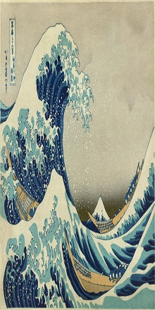</a>
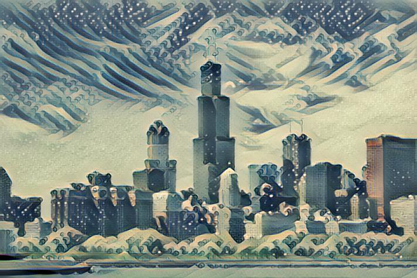
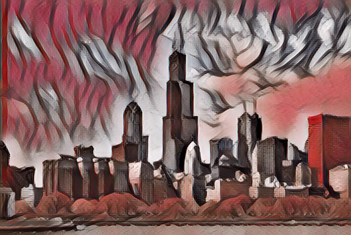
<a href = 'images/style/africa.jpg'>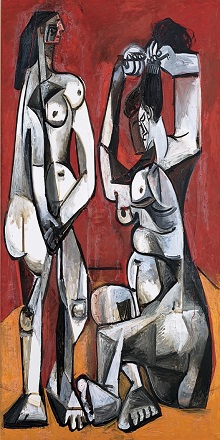</a>
 
<a href = 'images/style/aquarelle.jpg'>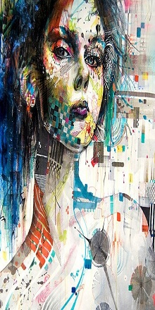</a>
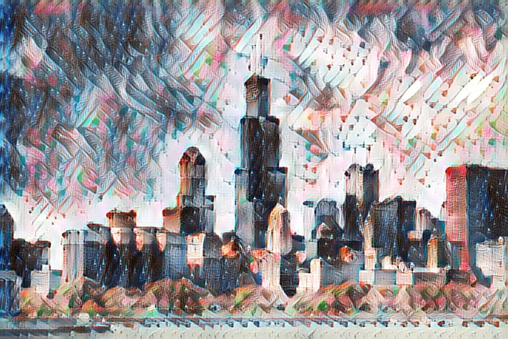
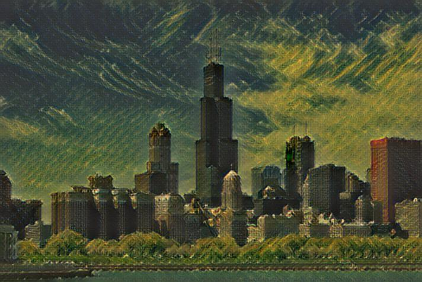
<a href = 'images/style/the_shipwreck_of_the_minotaur.jpg'>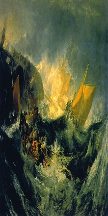</a>
 
<a href = 'images/style/starry_night.jpg'>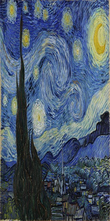</a>
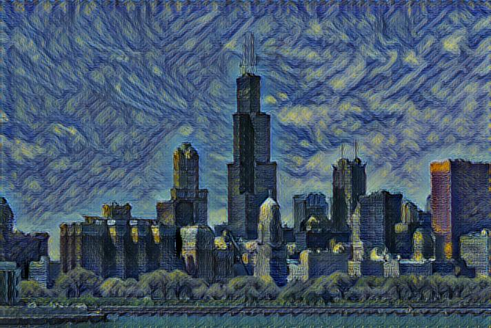
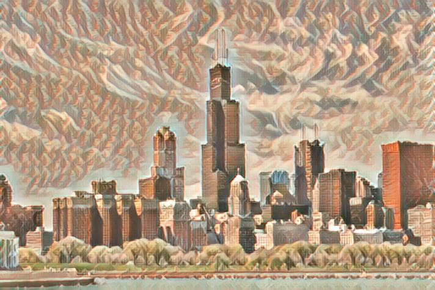
<a href = 'images/style/hampson.jpg'>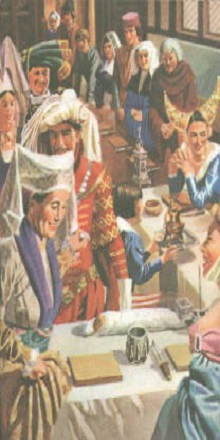</a>
 
<a href = 'images/style/chinese_style.jpg'>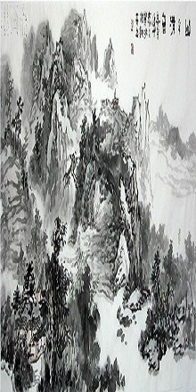</a>
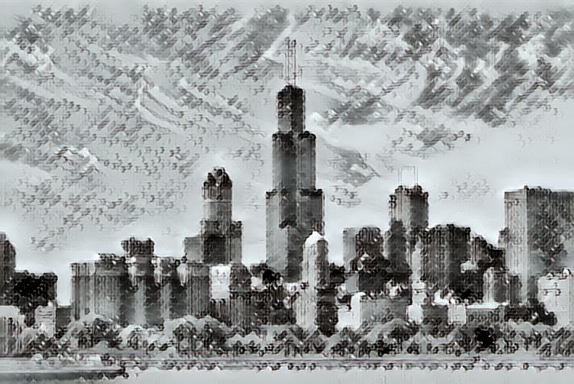
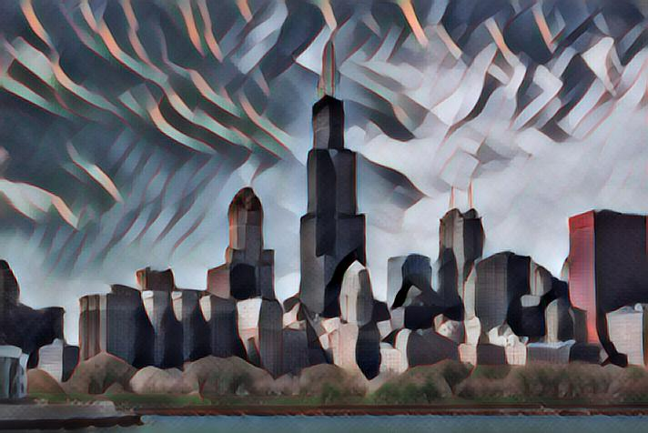
<a href = 'images/style/udnie.jpg'>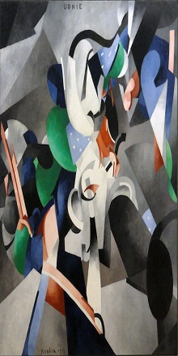</a>

All the models were trained on the same default settings.

## Implementation Details

- The **transformation network** is roughly the same as described in Johnson, except that batch normalization is replaced with Ulyanov's instance normalization, and the scaling/offset of the output `tanh` layer is slightly different (for better convergence), also use [Resize-convolution layer](https://distill.pub/2016/deconv-checkerboard/) to replace the regular transposed convolution for better upsampling (to avoid checkerboard artifacts)
- The **loss network** which is similar to the one described in Gatys, using VGG19 instead of VGG16 and typically using "shallower" layers than in Johnson's implementation, for larger scale style features in transformation (e.g. use `relu1_1` rather than `relu1_2`).

### Training Style Transfer Networks

Use `main.py` to train a style transfer network.

Example usage:

    python main.py train \
      --style ./path/to/style/image.jpg \
      --dataset ./path/to/mscoco \
      --weights ./path/to/model/weights \

### Evaluating Style Transfer Networks

Use `main.py` to evaluate a style transfer network.

Example usage:

    python main.py evaluate \
      --weights ./path/to/model/weights \
      --content ./path/to/content/image.jpg(video.mp4) \
      --result ./path/to/save/results/image.jpg
